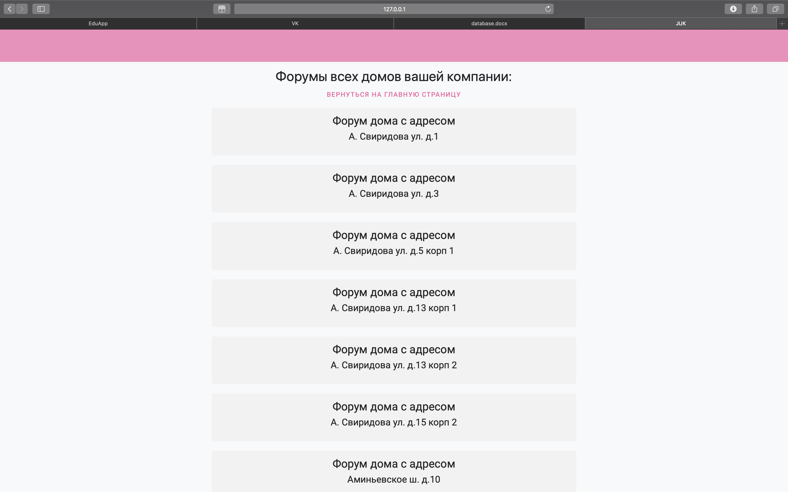
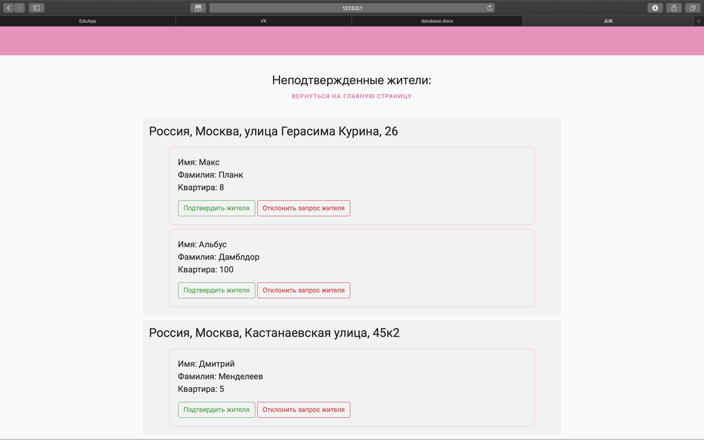

+++++++++++++++++++++++++++++++
Руководство пользователя по JUK
+++++++++++++++++++++++++++++++

**Предисловие**

Это руководство предоставлено Вам для более удобного обращения с нашим
сервисом. На последующих страницах вас ждёт детальное описание опций,
предлагаемых на сайте.

Житель
======

Если Вы являетесь жителем дома, подключённого к нашей сети, и хотите
активнее участвовать в жизни квартирного содружества, далее Вам
предоставляется инструкция по подключении квартиры к системе.

1. Первым делом необходимо зарегистрироваться. От Вас потребуется Ваш
адрес электронной почты, имя и фамилия. Вам придётся придумать себе
логин и пароль.

2. После выполнения предыдущей процедуры Вам будет необходимо
подтверждение проживания в доме. После регистрации Вам будет предложено
ввести адрес своего дома и номер квартиры. Под строками ввода находится
карта, на которой Вы можете проверить правильность введённого адреса.
Также Вы можете указать Ваш дом на карте, в результате чего его адрес
будет автоматически записан в строку адреса. В скорейшем времени
представители Управляющей компании (впоследствии УК) рассмотрят Вашу
заявку и, если всё указано верно, подтвердят Ваше проживание по
указанному адресу. В результате этого Вам откроется полный доступ к
функциям жильцов.

Функции:
--------

Поговорим, собственно, о функциях, к которым Вы только что получили
доступ.

1. Вы можете просматривать новости, оставленные вашему дому
представителями УК.

2. Вы можете зайти на форум вашего дома, где Вы имеете возможность
задать вопрос другим жителям вашего дома или представителям УК.

3. Вы можете узнать погоду в районе Вашего дома. Также при нажатии на
кнопку «Погода у Вас дома», Вас перенесёт на сайт Яндекс.Погоды.

4. Вы можете зайти в Ваш личный кабинет. Там у Вас есть возможность
сменить фотографию профиля, исправить Ваше имя и фамилию, если Вы
допустили ошибку прежде.

5. Вы можете пройти небольшой тест на право стать волонтёром. В нём
проверяется Ваша психологическая готовность помогать людям в нужде. Если
Вам не удастся пройти тест с первого раза, не стоит беспокоиться. Вам
будет доступно повторное прохождение теста через 3 дня. После
прохождения теста, Вам откроется доступ к открытым заданиям, которые Вы
можете принять.

4.Вы можете создать задание для других волонтёров во вкладке «Мои
задания»

5. Вы можете написать обращение к УК во вкладке «Обращения»

6. Вы можете воспользоваться функцией создания пропуска во вкладке
«Пропуска». У Вас есть возможность заказать пропуск как на машину, так и
на человека. Вам предстоит указать цель визита (выбрать из
предложенных). Для автомобиля указать цвет, модель и номер, для человека
— ФИО.

7. У Вас есть возможность выйти из аккаунта, нажав на кнопку «Выйти».

Менеджер
========

Если Вы являетесь представителем управляющей компании (впоследствии УК)
и хотите воспользоваться нашим сервисом, последующая инструкция позволит
Вам получить полный доступ к всем функциям.

1. Первым делом необходимо зарегистрироваться. От Вас потребуется Ваш
адрес электронной почты, имя и фамилия. Вам придётся придумать себе
логин и пароль.

2. После выполнения предыдущей процедуры Вам будет необходимо приписать
себя к какой-либо УК. Для этого необходимо указать ИНН компании, в
которой Вы работаете. В скорейшем времени наши админы подтвердят номер и
Вам откроется полный доступ к функциям менеджера.

Функции:
--------

Поговорим, собственно, о том, к чему Вы только что получили доступ.

1. Вы можете создавать и читать новости для жителей на странице новостей.

2. Вы можете рассматривать обращения, присылаемые компании со стороны жителей во вкладку «Открытые обращения Вашей компании».

3. Так же Вы можете писать и просматривать ваши обращения напрямую к жителям во вкладке «Мои обращения»

4. Вы можете просматривать форумы домов, принадлежащих к вашей УК, а также отдельно можете взглянуть на форум вашей компании.

5. У Вас есть возможность редактировать профиль во вкладке «Личный кабинет».

6. Вы можете просмотреть задания для волонтёров, выданные жильцами домов, приписанных к вашей компании.

7. Вы можете посмотреть на пропуски выданные для домов вашей компании во вкладке «Пропуски».

8. Вы можете подтверждать, что человек действительно является жителем дома, принадлежащего вашей УК во вкладке «Подтверждение жителей».

9. Вы можете добавить дом к Вашей УК во вкладке «Добавление дома».

**Как использовать эти возможности?**

В данном разделе представлена информация о том, как воспользоваться
каждой из функций

1. Просмотр новостей доступен по ссылке: *manager/news/,* здесь
отображены карточки с новостями:

|image0|

рис. 1

Перейти к конкретной новости и посмотреть ее содержание можно, нажав на
надпись “Перейти к новости”, (рис. 1)

Страница создания новостей доступна по ссылке: *manager/news/create/*
(также на нее можно перейти, нажав на кнопку “создать новость” на
странице просмотра новостей), здесь можно создать новость, указать
заголовок, содержание, принадлежность к району и важность новости
(interesting, important, urgently). (рис. 2)

|image1|

рис.2

2. Прочитать сообщения, присылаемые вашей компании от жителей, можно на
странице *manager/company_appeals/,* где кликнув по обращению, вы
перейдете на страницу с подробной информацией о нем.

3. Создать обращение к жителю можно на странице */cr_appeal* :

|image2|

рис. 3

Вам нужно указать тему и содержание обращения в соответствующие поля,
когда вы нажмете на кнопку “создать”, вы попадете на страницу обращения,
здесь вы можете вести диалог с жителем, которого вы указали при
создании:

|image3|

рис. 4

Все ваши обращения отображены на странице */my_appeals*, на нее можно
попасть, кликнув на кнопку “вернуться ко всем обсуждениям” (рис. 4) или
“вернуться” (рис. 3), кликнув на тему обращения вы попадете на страницу
с диалогом (рис. 4):

|image4|

рис. 5

4. Форумы домов, принадлежащих вашей компании, доступны на странице
/*manager/company_forums/*:

|image5|

рис. 6

Кликнув на заинтересовавший вас форум, вы перейдете на страницу выбора
обсуждений:

|image6|

рис. 7

Тут представлены темы на выбор, кликнув на кнопку с тему, вы перейдете
на страницу с соответствующими ей обсуждениями:

|image7|

рис. 8

На странице форума также можно создать обсуждение, нажав на кнопку
“создать обсуждение” (рис. 7):

|image8|

рис. 9

Здесь вы указываете заголовок обсуждения, его описание и возможность
отправлять анонимные сообщения (галочка “Анонимность”)

5. У вас есть личный кабинет, доступный по ссылке /*manager/my_cabinet:*

|image9|

рис. 10

Вы можете его редактировать на странице */tenant/editt_profile*, на
которую можете перейти, нажав на кнопку “редактировать профиль” (рис.
10)

Здесь вы указываете все данные, которые хотите изменить в
соответствующие поля (рис. 11):

|image10|

рис. 11

6. Просмотр заданий для волонтеров доступен по ссылке: */vol/help*

|image11|

рис. 12

7. Просмотр пропусков доступен по ссылке: */manager/pass/houses:*

|image12|

рис. 13

8. Вы можете подтверждать принадлежность жителя к дому на странице
/*manager/tenant_confirming/*

|image13|

рис. 14

9. Добавление дома в вашу УК доступно на странице */manager/add_house/:*

|image14|

рис. 15

